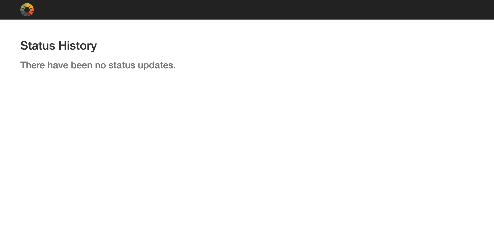
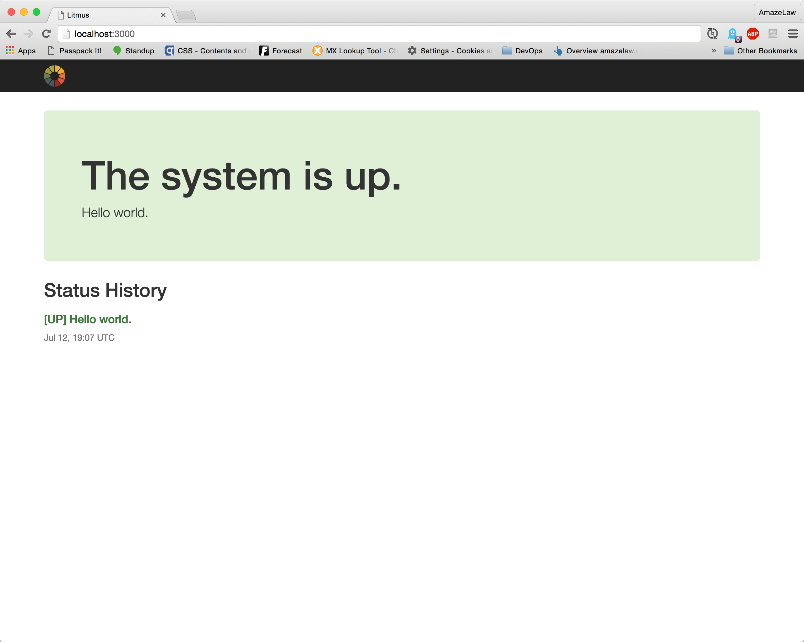
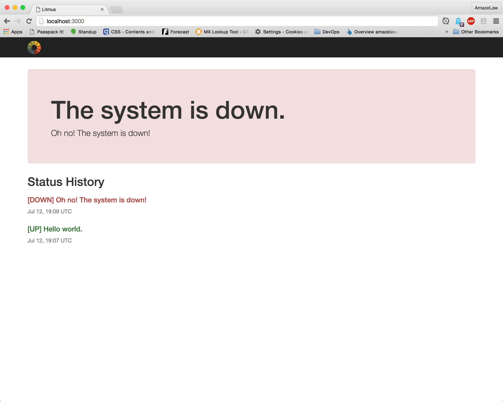

Status Page App
================

The goal of this application was to demonstrate building a backend API and front-end consumer of the same application. It was meant to be done in 4-6 hours. In addition to the front-end application, be sure to check out the specs as well. And let me know if you have any questions.

This application requires:

- Ruby 2.3.1
- Rails 4.2.6

Assumptions
------------
+ Sending a status update message without a status is valid, and in that case, the status for the update would be the last known status. If no status updates exist, then the update is invalid.

With more time
---------------
With a bit more time, here are some things I'd look to improve:
+ Stand-alone documentation for the API
+ Grouping status updates under some sort of "incidents" model.
+ Might consider using Rails 5 and ActionCable as a means of rendering real-time updates to the system status via WebSockets.

Getting Set Up
---------------
1. Install ruby 2.3.1
2. `> gem install bundler`
3. `> bundle`
4. `> bundle exec rake db:setup`
5. `> bundle exec rails server`

Running Tests
--------------------
1. `> bundle exec rake db:test:prepare`
2. `> bundle exec rspec`

Viewing the Status Site
----------------------------
1. Check out the site at localhost:3000, verify the empty state is in place and looks like: 
2. `curl -XPOST -H "Content-type: application/json" -d '{"system_status": "UP", "message": "Hello world."}' 'localhost:3000/api/v1/status.json'`
3. Refresh and see: 
4. `curl -XPOST -H "Content-type: application/json" -d '{"system_status": "DOWN", "message": "Oh no! The system is down!"}' 'localhost:3000/api/v1/status.json'`
5. Refresh and see: 

Using the API
===============

### Request

Requests should be in the following format:
```
curl -XPOST -H "Content-type: application/json" -d '{"system_status": "UP", "message": "Hello world."}' 'localhost:3000/api/v1/status.json'
```

#### Parameters

|Parameter          | Description|
|:------------------|:-----------|
| **system_status** | This is the status you want to set. Can be "UP" or "DOWN" |
| **message**       | This is a message you want to include in the status update. This is *not required*. |

**Note:** If a status update is sent without a `system_status`, it is assumed that the system status has not changed and should inherit the status from the previous update.


### Response

The response to the API will be in the following format and always include the current system status at the conclusion of handling the request:

```
{
  "current_status": {
    "system_status": "DOWN",
    "message": "Some message."
  }
}
```

### Error Handling

If there is an error in the API call, you will receive a 400 (Bad Request) response, as well as an `errors` object that indicates what was wrong with the request, a la:

```
{
  "current_status": {
    "system_status": "DOWN",
    "message": "Some message."
  },
  "errors": {
    "system_status": [
      "Status must be one of UP or DOWN."
    ]
  }
}
```
